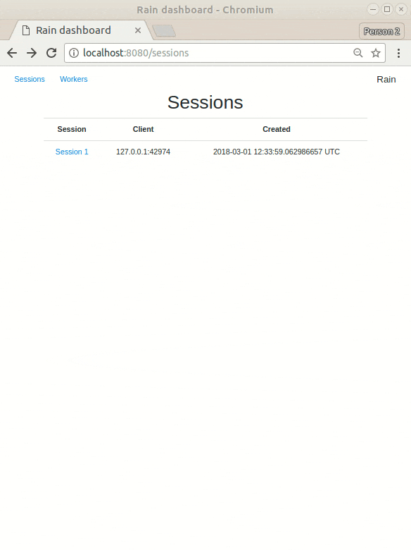

[](https://gitter.im/substantic/rain?utm_source=badge&utm_medium=badge&utm_campaign=pr-badge&utm_content=badge)[](https://travis-ci.org/substantic/rain)

# Rain


**Rain** is an open-source distributed computational framework for processing
of large-scale task-based pipelines.

Rain aims to lower the entry barrier to the world of distributed computing. Our
intention is to provide a light yet robust distributed framework that features
an intuitive Python API, straightforward installation and deployment with
insightful monitoring on top.

> Despite that this is an early release of Rain, it is a fully functional
> project that can be used out-of-the box. Being aware that there is still
> a lot that can be improved and added, we are looking for external
> users and collaborators to help to move this work forward.
> Talk to us online at Gitter or via email and let us know what your
> projects and use-cases need, submit bugs or feature
> requests at GitHub or even contribute with pull requests.

## Features

- **Dataflow programming.** Computation in Rain is defined as a flow graph of
  tasks. Tasks may be built-in functions, Python/C++/Rust code, or an external
  applications, short and light or long-running and heavy. The system is
  designed to integrate any code into a pipeline, respecting its resource
  requirements, and to handle very large task graphs (hundreds thousands tasks).

- **Easy to use.** Rain was designed to be easy to deployed anywhere, ranging
  from a single node deployments to large-scale distributed systems and clouds
  ranging thousands of cores.

- **Rust core, Python/C++/Rust API.** Rain is written in Rust for safety and
  efficiency and has a high-level Python API to Rain core infrastructure, and
  even supports Python tasks out-of-the-box. Rain also provides libraries for
  writing own tasks in C++ and Rust.

- **Monitoring.** Rain is designed to support both online and postmortem
  monitoring.

  

## Documentation

[Overview](http://substantic.github.io/rain/docs/overview.html) &bull; [Quickstart](http://substantic.github.io/rain/docs/quickstart.html) &bull; [User guide](http://substantic.github.io/rain/docs/user.html) &bull; [Python API](http://substantic.github.io/rain/docs/python_api.html) &bull; [Examples](http://substantic.github.io/rain/docs/examples.html)

## Quick start

- Download binary

```
$ wget https://github.com/substantic/rain/releases/download/v0.4.0/rain-v0.4.0-linux-x64.tar.xz
$ tar xvf rain-v0.4.0-linux-x64.tar.xz
```

- Install Python API

```
$ pip3 install rain-python
```

- Start server & a single local governor

```
$ ./rain-v0.4.0-linux-x86/rain start --simple
```

- Rain "Hello world" in Python

```python
from rain.client import Client, tasks, blob

client = Client("localhost", 7210)

with client.new_session() as session:
    task = tasks.Concat((blob("Hello "), blob("world!")))
    task.output.keep()
    session.submit()
    result = task.output.fetch().get_bytes()
    print(result)
```

### Installation via cargo

If you have installed Rust, you can install and start Rain as follows:

```
$ cargo install rain_server

$ pip3 install rain-python

$ rain start --simple
```

[Read the docs](http://substantic.github.io/rain/docs/examples.html) for more examples.
