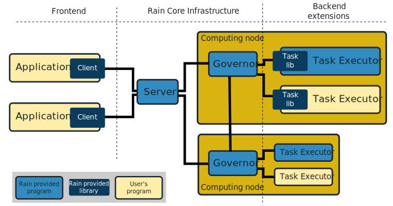

Concepts
********

Client
======

Session
=======

Data Objects
============

States
------

Content
-------

Modes
-----

Tasks
=====

States
------

Task types
----------

Server
======

Scheduler
---------

Worker
======

Subworker
---------
