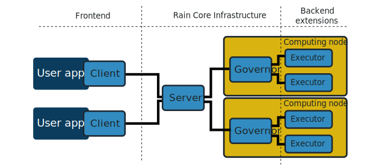

Overview
********

**Rain** is an open-source distributed computational framework written in
Rust_.

.. _Rust: https://www.rust-lang.org/en-US/

Rain is a framework that aims to lower the entry barrier to the world of
distributed computing. Our intention is to provide light yet robust distributed
framework that features an intuitive Python API, simple installation, and
straightforward deployment.

 * **User friendliness.** The computational backend of Rain was designed to be
   easy to deployed anywhere, ranging from a single node deployments to
   large-scale distributed systems and clouds. Rain API provides intuitive
   primitives for an intuitive interactions with the backend.
 
 * **Graph based computation.** Rain is task-based. Rain
   provides a predefined set of task types that can be used for building large
   variety of Rain applications out-of-the-box. It also provides a support for an
   easy integration of third-party applications or even tasks defined as
   arbitrary Python code.

 * **Python first.** Rain applications are defined as a pure Python code via
   the Rain API module with no other configuration files required whatsoever.
 
 :doc:`Get started now. </quickstart>`

What is in the box
==================

Rain task execution engine
--------------------------

   * Basic schedulling heuristic respecting inter-task dependencies.
   * Basic dashboard for execution monitoring.
   * Efficient and extensible implementation in Rust enabling easy build and deployment.
   * All-in-one binary with staticaly linked dependencies.
   * Direct worker-to-worker communication.

Easy-to-use Python API
----------------------

   * Task-based oriented programming model.
   * Intuitive interface to Rain task execution engine.
   * Python3 module.
   * Powerful task abstraction providing various predefined task types including
     support for exection of third-party applications.

Architecture
------------

Rain infrastructure composes of central **server** component and several
**worker** components.

The server interacts with one or more **client** applications through which the
computation description is provided. Server implements its own schedulling
engine that controls the distributed task execution on suitable workers.

Workers execute tasks as instructed by the server. Tasks are executed directly
by a worker or using a specialized subworker.

Wishlist
========

There are many things to improve, and even more new things to add. To work
efficiently, we need to prioritize and for that we need your feedback and use
cases. Which features would you like to see and put to good use? What kind of
pipelines do you run?

Better dashboard
----------------

Better interactive view on the current and past computation status, including
post-mortem analysis. Which stats and views give you the most insight?

Better scheduler
----------------

While surprisingly efficient, the current scheduler is currently mostly based on
heuristics and rules. We plan to replace it with an incremental global scheduler
based on belief propagation.

Resiliency
----------

The current version supports and propagates some failures (remote python task
exceptions, external program errors) but other errors still cause server panic
(e.g. worker node failure). The near-term goal is to have better failure modes
for introspection and possibly recovery. The system is designed to allow
building resiliency against task or worker failures via checkpoints in the task
graph (keeping file copies). It is not clear how useful to our users this would
be but it is on our radar.

Resources
---------

Currently, the only resources supported are CPU cores. We are working on also
supporting memory requirements, but other resources (GPUs, TPUs, disk space,
...) should be possible with enough work and interest.

Directory and stream objects support
------------------------------------

Currently, only plain file objects are supported (with optional content type
hints). We are working on also supporting arbitrary directories, picking just a
subset of files for transport and "lazy" remote access. This will also allow for
simple map/array data types for large volumes. Some tasks work in a streaming
fashion and it would be inefficient to wait for their entire output before
starting a consumer task. We plan to include streaming data objects but there
are semantic and usage issues about resources, scheduling, multiple consumers
and resiliency.

Plain C/C++ tasks and subworkers
--------------------------------

Right now, the availabe tasks are either built in, external programs or python
routines. It should be possible and straightforward to turn your C or C++ (or
other language) function to a custom task by creating a new subworker. We plan a
simple C library subworker scaffold that will allow easy gray-box subworkers.
You do not have to link agains Rain, which should make deployment easier.

REST client interface
---------------------

The capnp API is a bit heavy-handed for a client API. We plan to create a REST
API for the client applications, simplifying API creation in new languages, and
to unify it with the dashboard/status query API. External REST apis are
convenient for many users and they do not seem to be a performance bottleneck.

Easier Deployment in cloud settings
-----------------------------------

The Rust binary is already one staically linked file and one python-only
library, making distribution easy and running on PBS is already supported. We
would like to add better support for cloud settings, e.g. AWS and Kubernetes.

No-go zone
==========

There are also some directions we do NOT intend to focus on in the scope of Rain.

Visual editor
-------------

We do not plan to support visual creation and editing of pipelines. The scale of
reasonably editable workflows is usually very small. We focus on clean and easy
client APIs and great visualization.

User isolation and task sandboxing
----------------------------------

We do not plan to limit malicious users or tasks from doing any harm. Use
existing tools for task isolation. The system is lightweight enough to have one
instance per user if necessary.

Fair user scheduling, accounting and quotas
-------------------------------------------

When running multiple sessions, there is no intention to fairly schedule or
prioritize them. The objective is only overally efficient resource usage.

Comparison with similar tools
=============================

TODO

We are not alone and we know it!

Spark, Dask

Roadmap
=======

v0.2
----

* Worker/Subworker crash resilience
* More clever scheduler
* Directories as blobs

v0.1
----

* Basic functionality - all components are working, basic build-in tasks,
  external programs and Python tasks may be used.
* Simple (but not stupid) scheduler
