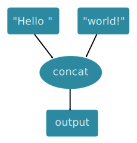

User's Guide
************

Basic terms
===========

**Task** is a basic unit of work in Rain, it reads inputs and produces outputs.
Tasks are executed on computational nodes (computers where Rain workers are
running). Tasks can be external programs, python functions, and other basic
build-in tasks.

**Data objects** are objects that are read and created by tasks. Data objects
are immutable, once they are created they cannot be modified. They are generic
data blobs with accompanying metadata. It is upto tasks to interpret the data
object content.

Task definition and submission
==============================

Rain represents your computation as a graph of tasks and data objects. Tasks are
not eagerly executed during the graph construction. Instead, the actual
execution is managed by Rain infrastructure after explicit submission. This
leads to a programming model in which you first only **define** a graph and then
**execute** it.

Let us consider the following example, where two constant objects are created
and merged together::

  from rain.client import Client, tasks, blob

  client = Client("localhost", 7210)  # Create a connection to the server
                                      # running at localhost:7210

  with client.new_session() as session:  # Creates a session

      a = blob("Hello ")    # Create a definition of data object in the current session
      b = blob("world!")    # Create a definition of data object in the current session
      tasks.concat((a, b))  # Create a task definition in the current session
                            # that concatenates input data objects

      session.submit()      # Send the created graph into the server, where the computation
                            # is performed.
      session.wait_all()    # Wait until all submitted tasks are completed

The graph composed in the session looks as follows:

When the graph is constructed, all created objects and tasks are put into the
active session. In many cases, it is sufficient just to create one session for
whole program lifetime, with one submit at the end. However, it is possible to
create more sessions or built a graph gradually with more submits. More details
are covered in Section :ref:`sessions`.

Fetching data objects
=====================

Data objects produced by tasks are not transferred back to the client
automatically. If needed, this can be done using the ``fetch()`` method. It
returns :class:`rain.common.DataInstance` that wraps data together with some
additional information. To get raw bytes from :class:`rain.common.DataInstance`
you can call method ``get_bytes()``.

In the following example, we download the result back to the Python client code.
Expression ``t.output`` refers to the data object that is the output of task
``t``::

  from rain.client import Client, tasks, blob

  client = Client("localhost", 7210)

  with client.new_session() as session:
      a = blob("Hello ")
      b = blob("world!")
      t = tasks.concat((a, b))
      t.output.keep()            # Tell server to keep result of task

      session.submit()           # Submit task graph

      result = t.output.fetch()  # Download result from the server
      print(result.get_bytes())  # Prints b'Hello world!'

By default, Rain automatically removes data objects that are no longer needed
for further computation. Method ``keep()`` sets a flag to a given data object
that instructs the server to keep the object until the client does not
explicitly frees it. An object can be freed when the session is closed or when
``unkeep()`` method is called. Method ``keep()`` may be called only before the
submit. Method ``unkeep()`` may be called on any "kept" object any time.

If method ``fetch()`` is called and the object has not been finished yet, the
method blocks until the object is not finished. Note that this is the reason,
why we did not use ``wait_all()`` in this example.

Inter-task dependencies
=======================

Naturally, an output of a task may be used as an input for another task. This
is demonstrated by the following example. In the example, we use
``tasks.sleep(T, O)`` that creates a task taking an arbitrary data object ``O``
and waits for ``T`` seconds and then returns ``O`` as its output. Being aware
that such task is not very useful in practice, we find it useful as an
intuitive example to demostrate the concept of task chaining::

  from rain.client import Client, tasks, blob

  client = Client("localhost", 7210)

  with client.new_session() as session:
      a = blob("Hello ")
      b = blob("world!")
      t1 = tasks.sleep(1.0, b)   # Wait for one second and then returns 'b'
      t2 = tasks.concat((a, t1.output))
      t2.output.keep()

      session.submit()           # Submit task graph

      result = t2.output.fetch()  #  It will wait around 1 second
                                  #  and then returns b'Hello world'

If a task produces only a single output, we can ommit ``.output`` and directly use the task
as an input for another task. In our example, we can define ``t2`` as follows::

  t2 = tasks.concat((a, t1))

This shortened notation is used in the rest of the text.

More outputs
============

A task may generally create zero, one, or more outputs. All outputs are
accessible via attribute ``outputs``. That contains an instance of
:class:`rain.client.LabeledList`. It is an extension of a standard list
(indexed from zero), that also allows to be accessed via string labels.

::

   # The following task creates two outputs labeled "output1" and "output2"
   # Details of this task is explained later
   t = tasks.execute(["tee", Output("output1")], stdout="output2", stdin=data)

   t.outputs["output1"]  # Access to output "output1"
   t.outputs["output2"]  # Access to output "output2"

   # There is also some helper functions:
   # Keep all outputs (equivalent to: for o in t.outputs: o.keep())
   t.keep_outputs()

   # After submit
   # Fetch all outputs (equivalent to: [o.fetch() for o in t.outputs])
   t.fetch_outputs()

Content types
=============

Data objects may represent different type of data in different formats.
However, Rain treats all data objects as raw binary blobs, and it is up to
tasks to interpret them. Content type is a string identifier that helps to
identify the format of the data and choose the right parser. Python code also
recognize some of content types and allows to load them.

Recognized content types:

  * <None> - Raw binary data
  * pickle - Serialized Python object
  * cloudpickle - Serialized Python object via Cloudpickle
  * json - Object serialized into JSON
  * cbor - Object serialized into CBOR
  * text - UTF-8 string.
  * text:<ENCODING> - Text with user specified encoding
  * mime:<MIME> - Content type defined as MIME type
  * user:<TYPE> - User defined type, <TYPE> may be arbitrary string

Constant data objects
=====================

Function :func:`rain.client.blob` serves for a creation of a constant data
object. The content of the data object is uploaded to server together with the
task graph.

::

   from rain.client import blob, pickled

   blob(b"Raw data")  # Creates a data object with defined content

   blob(b"Raw data", label="input data")  # Data with non-default label

   blob("String data")  # Creates a data object from string, content type will
                        # is set to 'text'

   blob("[1, 2, 3, 4]", content_type="json")  # Data with specified content type

   blob([1, 2, 3, 4], encode="json")  # Serialize python object to JSON and specify
                                      # content type to "json"

   blob([1, 2, 3, 4], encode="pickle")  # Serialize python object by pickle
                                        # content type to "pickle"

   pickled([1, 2, 3, 4])  # Same as line above

Build-in tasks
==============

The following four tasks are supported directly by Rain worker:

* *concat* (:func:`rain.client.tasks.export`) Concatencates inputs into one
  resulting blob.
* *export* (:func:`rain.client.tasks.export`) Saves data object to a filesystem.
  The data are saved into local file system of the worker on which the task is
  executed. This task is usually used for saving files to a distributed file
  system, hence it does not matter which worker performs the task.
* *open* (:func:`rain.client.tasks.open`) Creates data object from a file (Note:
  The current version does not support tracking external resources; therefore,
  this operation "internalize" file, i.e. it makes a copy of it into the working
  directory.
* *sleep* (:func:`rain.client.tasks.sleep`) Task that forwards its input as
  output after a specified delay.

::

  # This example demonstrates usage of four build-in tasks

  from rain.client import tasks, Client, blob

  client = Client("localhost", 7210)

  with client.new_session() as session:

      # Create tasks opening an external file
      data1 = tasks.open("/path/to/data")

      # Create a constant object
      data2 = blob("constant data")

      # Merge two objects
      merge = tasks.concat((data1, data2))

      # Sleep for 1s
      result = tasks.sleep(1, merge)

      # Write result into file
      tasks.export(result, "/path/to/result")

      session.submit()
      session.wait_all()

Running external programs
=========================

Task ``tasks.execute``
----------------------

The whole functionality is built around build-in task
:func:`rain.client.tasks.execute`. When a program is executed through
:func:`rain.client.tasks.execute`, then a new temporary directory is created.
This directory will be removed at the end of program execution. The current
working directory of the program is set to this directory.

The idea is that this directory is program's sandbox where input data objects
are mapped and files created in this directory may be moved out as new data
objects when computation completes. Therefore, in contrast with many other
workflow systems, Rain programs should not be used with absolute paths but use
paths relative to its working directory. Workers try to avoid unnecessary data
object replication in the cases when a data object is used by multiple tasks
that run on the same worker.

If the executed program terminates with a non-zero code, then tasks fails and
standard error output is written into the error message.

The simple example looks as follow::

  tasks.execute("sleep 1")

This creates a task with no inputs and no outputs executing program "sleep" with
argument "1". Arguments are parsed in shell-like manner.
Arguments can be also specified explicitly as a list::

  tasks.execute(("sleep",  "1"))

Command may be also interpreted by shell, if the argument ``shell=True`` is
provided::

  tasks.execute("sleep 1 && sleep 1", shell=True)

Outputs
-------

Files created during task execution or task standard output can be used as the
output of :func:`rain.cient.tasks.execute`. The following example calls program
``wget`` that downloads web page https://github.com/ and saves it as
`index.html`. The created file is forwarded as output of the task.

::

  from rain.client import Client, task, Output

  client = Client("localhost", 7210)

  with client.new_session() as session:
      t = tasks.execute("wget https://github.com/",
                         output_files=[Output("index", path="index.html")])
      t.output.keep()

      session.submit()
      result = t.output.fetch().get_bytes()

The class :class:`rain.client.Output` allows to configure the outputs. The
first argument is the label of the output. The argument ``path`` sets the path
to output file. It is a relative path w.r.t. the working directory of the task.
If the path is not defined, then label is used as path; e.g.
``Output("my_output")`` is equivalent to ``Output("my_output",
path="my_output")``. The Output instance can be also used for specification of
additional attributes such content type or size hint. Please see the class
documentation for more details.

If we do not want to configure the output, it is possible to use just string
instead of instance of ``Output``. It creates the output with the same label and
path as the given string. Therefore we can create the task as follows::

  t = tasks.execute("wget https://github.com/", output_files=["index.html"])

The only difference is that label of the output is now "index.html" (not
"index").

Of course, more than one output may be specified. Program ``wget`` allows
redirect its log to a file through ``--output-file`` option::

  t = tasks.execute("wget https://github.com/ --output-file log",
                    outputs_files=["index.html", "log"])

This creates a task with two outputs with labels "index.html" and "log". The outputs
are available using standard syntax, e.g. ``t.outputs["log"]``.

Outputs can be also passed directly as program arguments. This is a shortcut for
passing the output path as an argument. The example above can be written as
follows::

  t = tasks.execute(["wget", "https://github.com/", "--output-file", Output("log")],
                    output_files=["index.html"])

The argument ``stdout`` allows to use program's standard output::

   # Creates output from stdout labelled "stdout"
   tasks.execute("ls /", stdout=True)

   # Creates output from stdout with label "my_label"
   tasks.execute("ls /", stdout="my_label")

   # Creates output through Output object, argument 'path' is not allowed
   tasks.execute("ls /", stdout=Output("my_label"))

Inputs
------

Data objects can be mapped into the working directory of :func:`rain.client.tasks`.
The simplest case is to use a data object directly as arguments for a program.
In such case, data object is mapped into randomly named file which name is
placed into program arguments.

::

  from rain.client import Client, task, blob

  client = Client("localhost", 7210)

  with client.new_session() as session:
      data = blob(b"It is\nrainy day\n")

      # Execute "grep rain XXX" where XXX is a random name where dataobject in
      # variable 'data' is mapped
      task = tasks.execute(["grep", "rain", data], stdout=True)
      task.output.keep()

      session.submit()
      print(task.output.fetch().get_bytes())  # Prints b"rainy day"

For additional settings and file name control, there is
:class:`rain.client.Input`, that is a counter-part for
:class:`rain.client.Output`. It can be used as follows::

    from rain.client import Client, task, Input

    ...

    # It executes a program "a-program" with arguments "argument1" and "myfile"
    # and while it maps dataobject in variable 'data' into file 'myfile'
    my_data = ... # A data object
    task = tasks.execute(["a-program", "argument1",
                          Input("my_label", path="myfile", dataobj=my_data)])

The argument ``input_files`` of :func:`rain.client.tasks.execute` serves to map a
data object into file without putting filename into program arguments::

  # It executes a program "a-program" with arguments "argument1"
  # and while it maps dataobject in variable 'data' into file 'myfile'
  tasks.execute(["a-program", "argument1"],
                input_files=[Input("my_label", path="myfile", dataobj=my_data)])

The argument ``stdin`` serves to map a data object on the standard input of the
program::

  # Executes a program "a-program" with argument "argument1" while mapping
  # a data object on the standard input
  tasks.execute(["a-program", "argument1"], stdin=my_data)

Factory ``Program``
-------------------

In many cases, we need to call the same program with the same argument set.
Class :class:`rain.client.Program` serves as a factory for
:func:`rain.client.tasks.execute` for this purpose. Instance of ``Program`` can
be called as a function that takes data objects; the call creates a task in the
active session.

::

  from rain.client import Client, blob, Program, Input

  rain_grep = Program(["grep", "rain", Input("my_input", path="my_file")], stdout=True)

  client = Client("localhost", 7210)

  with client.new_session() as session:
      data = blob(b"It is\nrainy day\n")

      # Creates a task that executes "grep rain my_file" where dataobject in variable
      # 'data' is mapped into <FILE>
      task = rain_grep(my_input=data)

``Program`` accepts the same arguments as ``execute``, including
``input_files``, ``output_files``, ``stdin``, and ``stdout``. The only
difference is that ``Input`` used for ``Program`` cannot use ``dataobj``
argument, since ``Program`` defines "pattern" indepedently on a particular
session.

Python tasks
============

Among build-in tasks, Rain allows to run additional types of tasks via
subworkers. Rain is shipped with Python subworker, that allows to execute
arbitrary Python code.

Decorator ``@remote``
---------------------

Decorator :func:`rain.client.remote` turns a python function into a
Rain task. Let us consider the following example::

  from rain.client import Client, remote

  @remote()
  def hello(ctx):
      return "Hello world!"

  client = Client("localhost", 7210)

  with client.new_session() as session:
      t = hello()                # Create a task
      t.output.keep()
      session.submit()
      result = t.output.fetch()
      print(result)              # Prints b'Hello world!'

The decorator changes the behavior of the decorated function in a way that
calling it no longer executes it in the client but creates a task that executes
the function in a python subworker. Worker starts and manages subworkers as
necessary, there is no need of any action from the user.

The decorated function accepts at least one argument. As the first argument,
the context of the execution is passed to the function. Context enables some
actions within the task. It is a convention to name this argument as ``ctx``.

Inputs
------

Decorated function may take more parameters than ``ctx``; these parameters
define inputs of the task. By default, they can be arbitrary Python objects and
they are serialized via ``cloudpickle``. If the decorated function is called
with an ordinary Rain data object, it is invokend with
:class:`rain.common.DataInstance` that contains data defined by data object::

  from rain.client import Client, remote, blob

  @remote()
  def hello(ctx, data1, data2):
      return data1 + data2.get_bytes()

  client = Client("localhost", 7210)
  with client.new_session() as s:

      # Create data object
      data = blob("Rain!")

      # Creates a task calling function 'hello' in worker
      t = hello(b"Hello ", data)

      t.output.keep()
      s.submit()
      s.wait_all()

      # Prints b'Hello Rain!"
      print(t.output.fetch().get_bytes())

In remotely executed Python code, Rain data objects are replaced with actual
data instances during serialization. All occurences of data objects are
replaced, even those encapsulated in own data structures::

  class MyClass:

      def __init__(self, my_data):
          self.my_data = my_data

   @remote()
   def my_call(ctx, input):
       # If we assume a call of this function as below,
       # we obtain instance of MyClass where attribute 'my_data'
       # is list of instances of DataInstance
       return b""

   ...

   my_instance = MyClass([blob(b"data1"), blob(b"data2"), blob(b"data3")])
   task = my_call(my_instance)

.. note::
   It is possible to pass also generators as arguments to remote functions,
   and it works as expected. However, Rain has to include all
   data objects occuring in related expressions as task dependencies.
   Therefore, you may create more dependencies then expected.
   We recommend to evaluate generators before passing to remote functions,
   especiialy if it is a filtering kind of generator.

All metadata of data objects (including content type) are passed to the data
instances occuring in remote functions. Therefore, it is possible to call
method ``load()`` on data instance to deserialize objects according to their
content type::

   @remote()
   def fn1(ctx, data):
       # Load according content type. Throws an error if content type is not provided
       loaded_data = data.load()
       ...

   # Automatically call load() on specific argument
   @remote(inputs={"data": Input(load=True)})
   def fn2(ctx, data):
       ....

   # Automatically call load() on all arguments
   @remote(auto_load=True)
   def fn3(ctx, data):
       ....

   # Example of calling:
   data = blob([1,2,3,4], encode="json")
   fn1(data)

The second case uses :class:`rain.common.Input` to configure individual
parameters. It can be also used for additional configurations, like data object
size hints for Rain scheduler, or content type specification::

   # The following function asks for a dataobject with content type "json" as
   # its argument. If the function is called the following happens:
   # 1) If the input dataobject has content type "json", it is passed as it is
   # 2) If the input dataobject has no content type (None), then content type "json"
        is set as the object content type
   # 3) If the input dataobject has content type different from "json", the task fails

   @remote(inputs={"data": Input(content_type="json")})
   def fn1(ctx, data):
       pass

Outputs
-------

By default, it is expected that a remote function returns one data object. It
may return an instance of ``bytes`` or ``str`` that will be used as content of
the resulting data object. If an instance of bytes is returned then the content
type of resulting object is ``None``, if a string is returned then the content
type is set to "text". A remote function may also return data instance, when
you want to set additional attributes of data object. More outputs may be
configured via ``outputs`` attribute of remote::

    @remote()
    def fn1(ctx):
        return b"Returning bytes"

    @remote()
    def fn2(ctx):
        return "Returning string"

    # Configuring more unlabaled outputs
    @remote(outputs=3)
    def fn3(ctx):
        (b"data1", b"data2", b"data3")

    # No output
    @remote(outputs=0)
    def fn4(ctx):
         pass

    # Configuring labeled outputs
    @remote(outputs=("label1", "label2"))
    def fn5(ctx):
         return {"label1": b"data1", "label2": b"data2"}

    # Set content types of resulting objects
    @remote(outputs=(Output(content_type="json"), Output(content_type="json"))
    def fn6(ctx):
        return ("[1, 2, 3]", "{'x': 123}")

    # Automatically encode resulting objects
    @remote(outputs=(Output(encode="pickle"), Output(encode="json"))
    def fn7(ctx):
        return ([1, 2, 3], {"x": 123})

Type hints
----------

If you are using sufficiently new Python (>=3.5), you can use type hints
to define outputs and inputs, e.g.::

    @remote
    def test1(ctx, a : Input(content_type="json")) -> Output(encode='pickle', label='test_pickle');
        pass

Resources
=========

In the current version, the only resource that can be configured is the number
of cpus. This following example shows how to request a a specific number of
cpus for a task::

  # Reserve 4 CPUs for execution of a program
  tasks.execute("a-parallel-program", cpus=4)

  # Resere 4 CPUs for a Python task
  @remote(cpus=4)
  def myfunction(ctx):
      pass

Attributes
==========

Each task and data object has an assigned *attributes* a dictionary of JSON
serializable values. Some attributes are set when task/object is created,
some are added when object is computed or finished. When an object/task
is finished, attributes are no longer changed.

Client may ask for attributes of any task/object as long as session is open,
"keep" flag is not necessary. Attributes are not updated automatically,
``fetch()`` or ``update()`` has to be called to update attributes.

::

    with client.new_session() as s:
        task = tasks.execute("sleep 1")
        s.submit()

        s.wait_all()

        # Download recent attributes
        task.update()

        # Print name of worker where task was executed
        print(task.attributes["info"]["worker"])

TODO: List of build-in attributes

Users are allowed to store arbitrary information under keys "user_spec" and "user_info".
The former serves for task configuration, the latter serves for information generated
during task execution.

::

    @remote()
    def attr_demo(ctx):
       # read user defined attributes
       spec = ctx.attributes["user_spec"]

       # setup new "user_info" attribute
       ctx.attributes["user_info"] = [1, 2, spec]
       return b"Result"

    with client.new_session() as session:
        task = attr_demo()
        task.attributes["user_spec"] = "mystring"
        session.submit()
        session.wait_all()
        task.update()

        # prints: [1, 2, "mystring"]
        print(tasks.attributes["user_info"])

Waiting for object(s) and task(s)
=================================

Waiting for a completion of a single task/object is done using the ``wait()``
method directly on awaited task or data object. Multiple tasks/objects can be
awaited at once using the ``wait`` method with a set of tasks/obejcts on
session::

  with client.new_session() as session:
      a = blob("Hello world")
      t1 = tasks.sleep(1.0, a)
      t2 = tasks.sleep(2.0, a)
      session.submit()

      t1.wait()  # This blocks until t1 is finished, independently of t2
      t2.output.wait()  # Waits until a data object is not finished

      # The same as two lines above, but since we are doing it at once, it is
      # slightly more efficient
      session.wait([t1, t2.output])

.. note::

  Note that in the case of ``wait()`` (in contrast with ``fetch()``), object
  does not have to be marked as "kept".

.. _sessions:

Sessions
========

Overview
--------

The client allows to create one or more sessions. Sessions are the environment
scopes where application create task graphs and submit them into the server.
Sessions follows the following rules:

  * Each client may manage multiple sessions. Tasks and data object in different
    sessions are independent and they may be executed simultaneously.

  * If a client disconnects, all sessions created by the client are terminated,
    i.e. running tasks are stopped and data objects are removed.
    (Persistent sessions are not supported in the current version)

  * If any task in a session fails, the session is labeled as failed, and all
    running tasks in the session are stopped. Any access to tasks/objects in the
    session will throw an exception containing error that caused the problem.
    Destroying the session is the only operation that does not throw the exception.
    Other sessions are not affected.

Active session
--------------

Rain client maintains a global stack of sessions and ``with`` block moves a
session on the top of the stack and removes it from the stack when the block
ends. The session on the top of the stack is called *active* session. The
following example demonstrates when a session is active::

  from rain.client import Client, tasks, blob

  client = Client("localhost", 7210)

  # no session is active
  with client.new_session() as a:

      # 'a' is active

      with client.new_session() as b:
          # 'b' is active
          pass

      # 'b' is closed and 'a' is active again

  # 'a' is closed and no session is active

Tasks and data objects are always created within the scope of active session.

.. note::

   Which session is active is always a local information that only influences
   tasks and data objects creation. This information is not propagated to the
   server. Submitted tasks are running regardless the session is active or not.

Closing session
---------------

Session may be closed manually by calling method ``close()``, dropping the
client connection or leaving ``with`` block. To suppress the last named
behavior you can use the ``bind_only()`` method as follows::

  session = client.new_session()

  with session.bind_only():
      # 'session' is active
      pass

  # 'session' is not active here; however it is NOT closed

Once a session is closed, it is pernamently removed from the session stack and
cannot be reused again.

.. note::

  The server holds tasks' and objects' metadata (e.g. performance information) as
  long as a session is alive. If you use a long living client with many sessions,
  sessions should be closed as soon as they are not needed.

Multiple submits
----------------

The task graph does not have to be submmited at once; multiple submmits may
occur during the lifetime of a session. Data objects from previous submits
may be used while constructing a new new submit, the only condition is that
they have to be marked as "kept" explicitly.

::

   with client.new_session() as session:
      a = blob("Hello world")
      t1 = tasks.sleep(1.0, a)
      t1.output.keep()

      session.submit()  # First submit

      t2 = tasks.sleep(1.0, t1.output)

      session.submit()  # Second submit
      session.wait_all()  # Wait until everything is finished

      t3 = tasks.sleep(1.0, t1.output)

      session.submit()  # This submit
      session.wait_all()  # Wait again until everything is finished

Let us remind that method ``wait_all()`` waits until all currently running task
are finished, regardless in which submit they arrived to the server.

Directories
-----------

TODO: Not implemented yet
